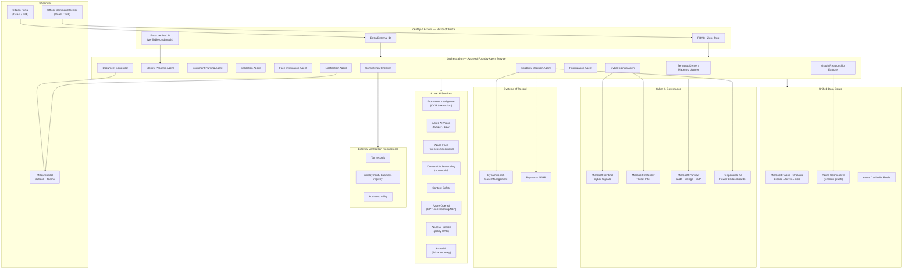
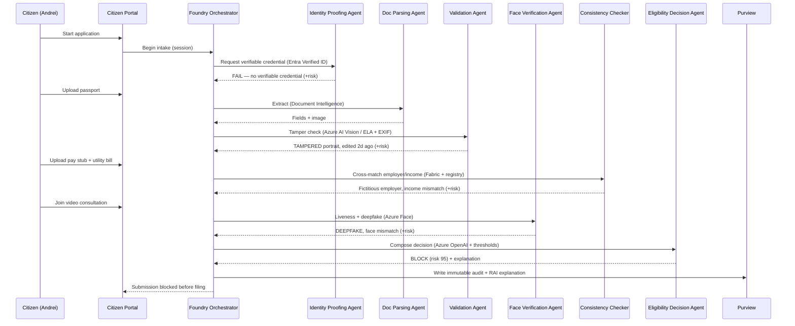
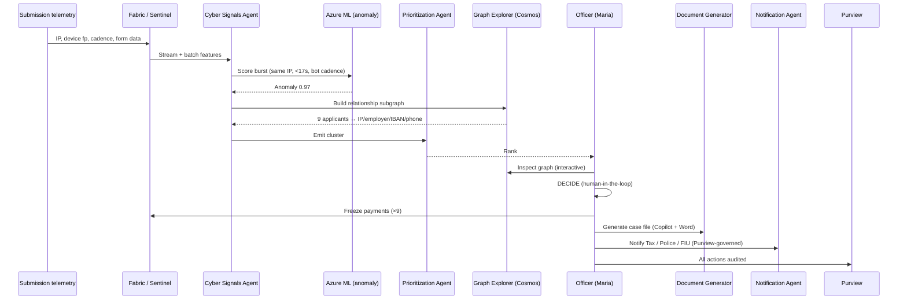
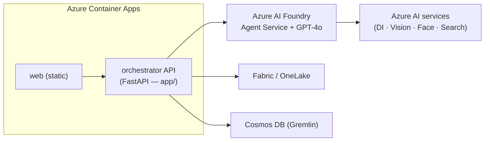

# Reference Architecture — Benefits Integrity Cloud (FWA Detection & Prevention)
### Code-build edition · grounded in *RefArch PH&SS — Enable detection and prevention for Fraud, Waste & Abuse*

This document is the technical blueprint for turning the interactive storyboard (`web/index.html`)
into a runnable, code-based demo. It maps every on-screen capability to a concrete Azure service,
SDK, and (where available) a Microsoft solution accelerator.

---

## 1. Logical architecture

---

## 2. Component inventory (capability → service → how to build)

See `docs/capability-map.md` for the full 18-capability table. Summary of the spine:

| Layer | Component | Azure service | SDK / API | Accelerator to start from |
|-------|-----------|---------------|-----------|---------------------------|
| UI | Citizen Portal + Officer console | Azure Container Apps / Static Web Apps | React | *(prototype in `web/`)* |
| Identity | Verifiable credential + auth | Entra External ID, Verified ID | MSAL, Verified ID request API | — |
| Orchestration | Multi-agent | **Azure AI Foundry Agent Service** | Foundry SDK + Semantic Kernel | **Multi-Agent Custom Automation Engine** |
| Doc AI | OCR / extraction / tamper | Document Intelligence, AI Vision, Content Understanding | `azure-ai-documentintelligence`, `azure-ai-vision` | **Document Knowledge Mining** |
| Identity AI | Liveness / deepfake | Azure Face | Face API (liveness SDK) | **Digital Identity Analyzer** |
| Reasoning | Decisions, NLP, case gen | Azure OpenAI (GPT-4o) | `openai` / Foundry | — |
| Retrieval | Policy grounding | Azure AI Search | `azure-search-documents` | Document Knowledge Mining |
| ML | Risk score + anomaly | Azure Machine Learning | `azure-ai-ml` | — |
| Data | Lakehouse + cross-match | Microsoft Fabric / OneLake | Fabric SQL/Spark | **Unified data foundation with Fabric** |
| Graph | Relationship network | Cosmos DB (Gremlin) | `gremlinpython` | — |
| Cyber | Signal & threat intel | Sentinel + Defender | Log Analytics / MDTI API | — |
| Governance | Audit, lineage, RAI | Purview + Power BI | Purview API | **Deploy Your AI App in Production** |
| SoR | Case + payments | Dynamics 365, ERP | Dataverse API | — |

---

## 3. Scenario 1 — pre-submission block (sequence)

**Decision logic:** weighted risk score with explainable contributions
`{document_tampering:0.34, deepfake_liveness:0.26, fictitious_employer:0.20, identity_unverifiable:0.12, cross_record_mismatch:0.08}`.
Block threshold ≥ 70. Minor-mismatch band (35–55, single low-weight signal) → **auto-reconcile or human review**, never auto-block (fairness safeguard).

---

## 4. Scenario 2 — post-submission detection (sequence)

**Cyber-signal feature vector (Scenario 2 fixtures):** see `data/scenario2-cluster.json`.
Key features: `same_source_ip`, `device_fingerprint_reuse`, `interarrival_seconds`, `fields_per_second`,
`shared_employer_unregistered`, `shared_iban_ratio`, `asn_is_hosting`.

---

## 5. Security, privacy & governance

- **Zero-Trust landing zone**, private endpoints, no public AI endpoints (pattern: *Deploy Your AI App in Production* accelerator).
- **Entra** External ID + Verified ID + RBAC; MFA for officers.
- **Purview**: immutable audit of every agent action and officer decision; data lineage Bronze→Gold; DLP on cross-agency disclosures (field-level minimization).
- **Responsible AI**: explainable risk contributions on every decision; Power BI RAI dashboards; documented fairness safeguard; human-in-the-loop on all enforcement actions.
- **Content Safety** on all generative output (case files, notifications).
- **Data minimization** in partner-agency notifications — each agency receives only authorized fields.

---

## 6. Deployment topology (demo)

- **Demo mode:** the `app/` FastAPI backend serves fixtures from `data/` so the demo runs with **zero Azure dependencies** — perfect for laptops and air-gapped rooms.
- **Live mode:** flip `DEMO_MODE=false` in `.env` and implement the `# TODO(live)` calls in `app/agents.py` against real Azure SDKs.

See `docs/build-plan.md` for the phased path from demo mode to live mode, and `infra/azure-resources.md` for the resource list.
